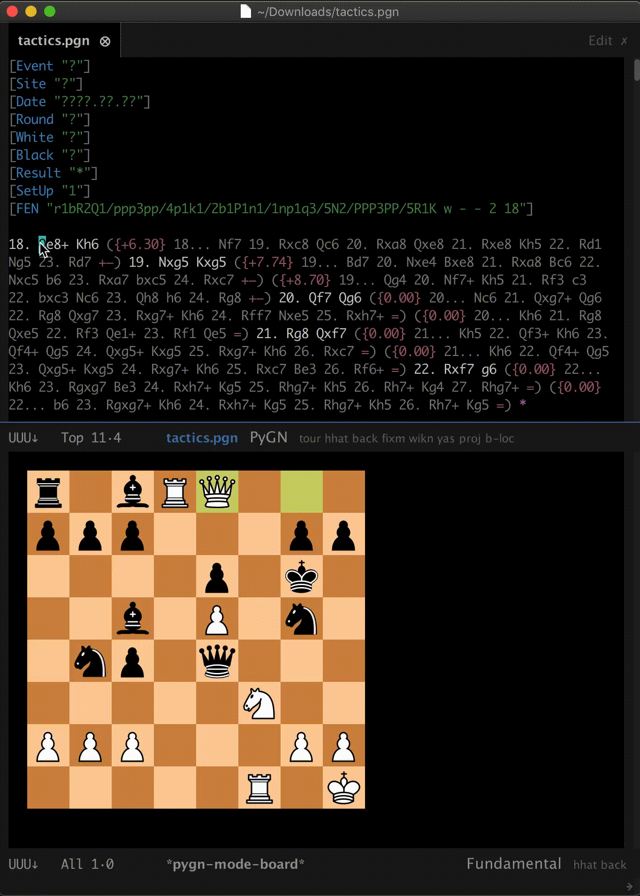
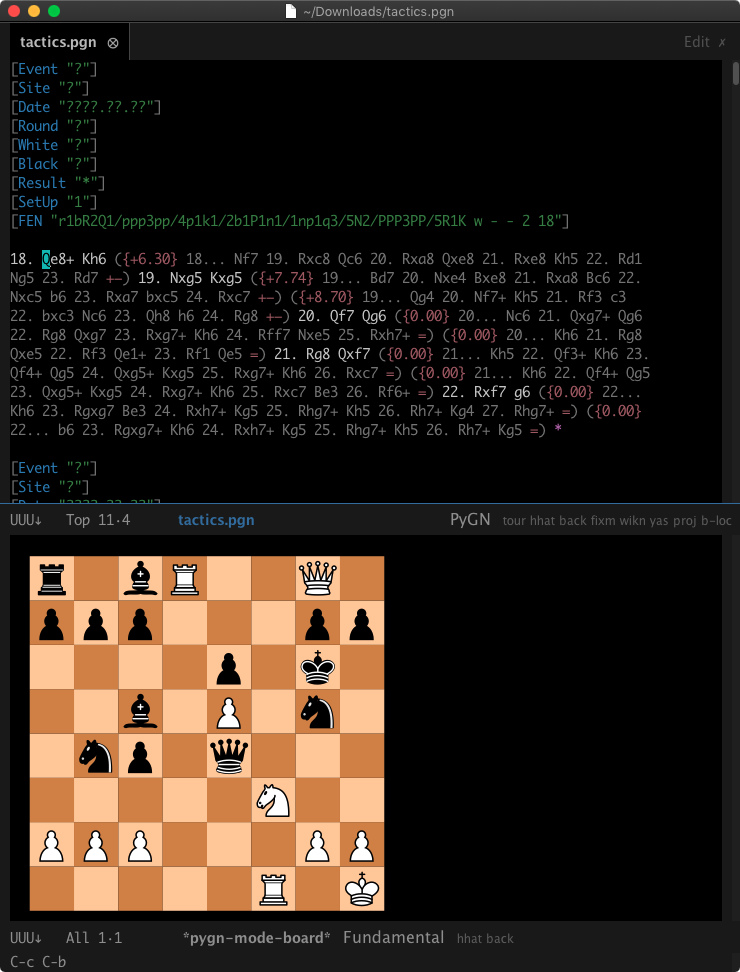
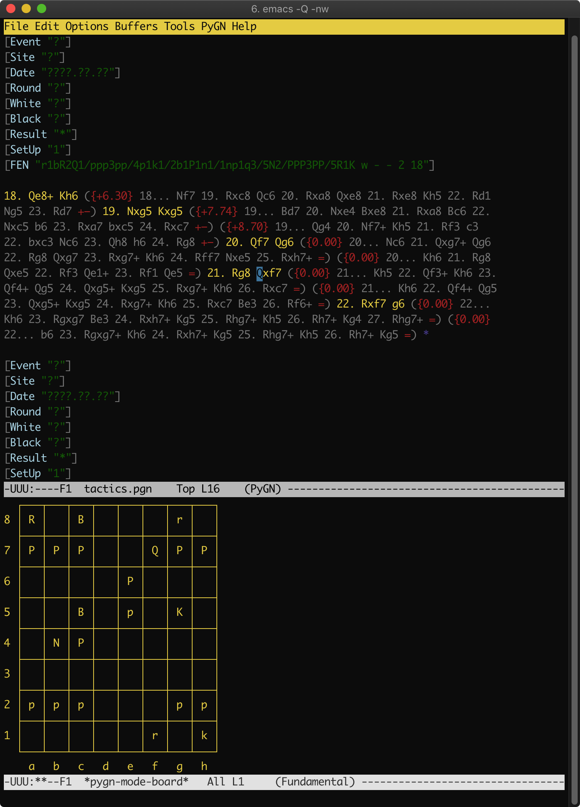
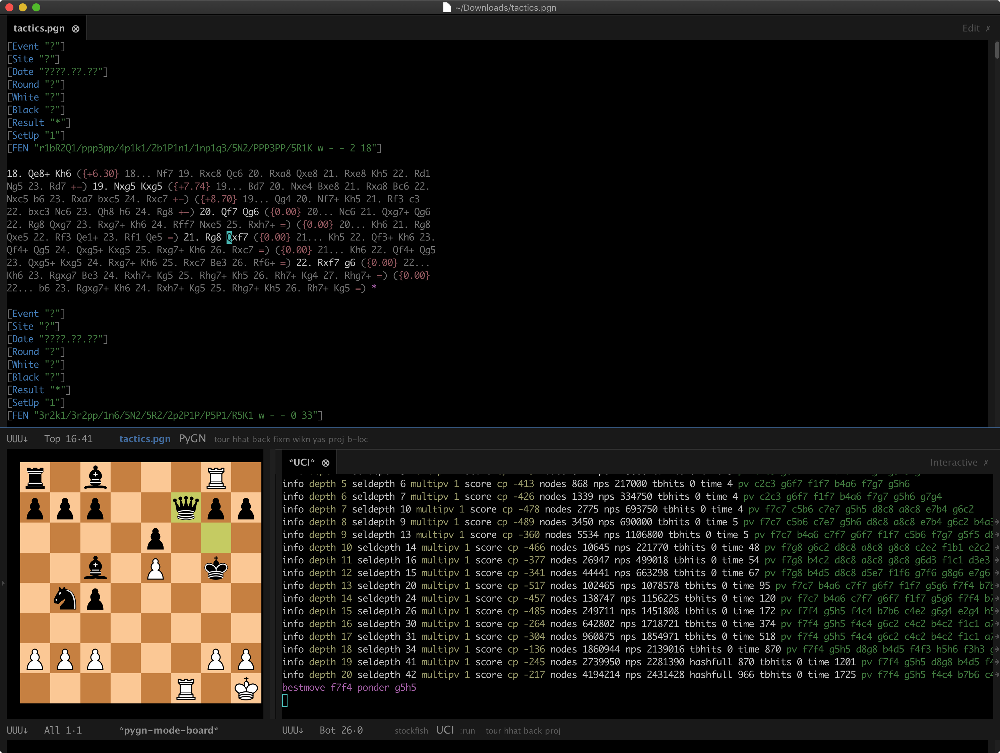
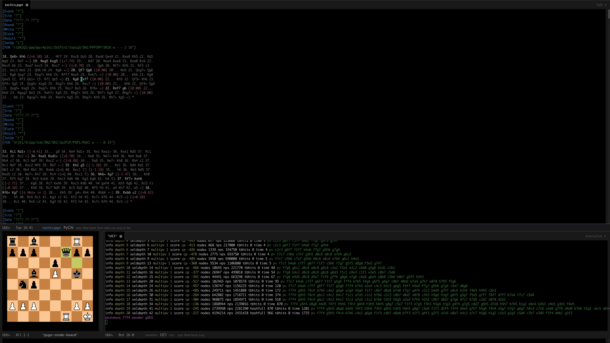

# Gallery

 * [Animated GUI Board](#animated-gui-board)
 * [GUI Board](#gui-board)
 * [TUI Board](#tui-board)
 * [UCI-mode Integration](#uci-mode-integration)
 * [UCI-mode Integration (wide)](#uci-mode-integration-wide)

# Animated GUI Board

 * The point is being advanced by `pygn-mode-next-move-follow-board`.

# GUI Board

 * The board was displayed by `pygn-mode-display-board-at-pos`.

# TUI Board

 * The board was displayed by `pygn-mode-display-board-at-pos`.

# UCI-mode Integration

 * The window layout was created by `pygn-mode-triple-window-layout-bottom`.
 * The board was displayed by `pygn-mode-display-board-at-pos`.
 * The UCI output was created by `pygn-mode-engine-go-depth`.

# UCI-mode Integration (wide)

 * The window layout was created by `pygn-mode-triple-window-layout-bottom`.
 * The board was displayed by `pygn-mode-display-board-at-pos`.
 * The UCI output was created by `pygn-mode-engine-go-depth`.

